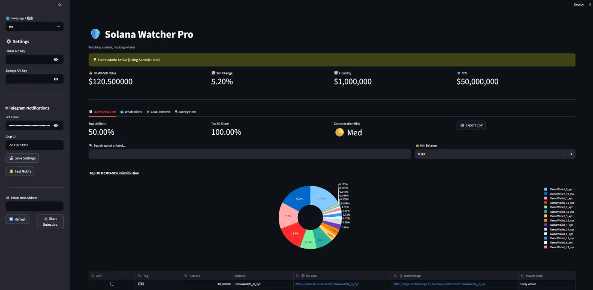

# 👁️ Solana Watcher Pro



[](https://opensource.org/licenses/MIT)
[](https://www.python.org/downloads/)
[](https://streamlit.io)

**Solana Watcher Pro** is a powerful, open-source dashboard designed for Solana traders to track token distributions, identify whale movements, and manage private wallet labels (CRM).

**Solana Watcher Pro** 是一款專為 Solana 交易者設計的專業級開源儀表板，用於追蹤代幣籌碼分佈、識別巨鯨動向並管理私人錢包標記 (CRM)。

---

## 🧭 Project Philosophy / 專案理念

> "In the world of on-chain data, information is public, but **context is private wealth**."
> 「在鏈上數據的世界裡，資訊是公開的，但**數據的脈絡才是私有的財富**。」

This tool is built on the philosophy of **"Standing on the shoulders of giants"** (Helius & Birdeye) while providing a **"Digital Detective's Notebook"** for individual traders to transform raw data into actionable intelligence.

本工具建立在「站在巨人肩膀上」（整合 Helius & Birdeye）的理念之上，同時為個人交易者提供一個「數位偵探筆記本」，將原始數據轉化為具備決策價值的情報。

---

## ✨ Features / 核心功能

### 📋 Wallet CRM (Global Identity) / 全域標記系統
- **Context Management**: Label whales, smart money, or your own wallets. Labels are stored locally in SQLite and persist across different token analyses.
- **全域身份識別**：標記巨鯨、聰明錢包或你自己的錢包。標籤儲存在本地 SQLite 中，切換代幣時會自動識別已知地址。

### 🐋 Whale Movement Alerts / 巨鯨異動警報
- **Delta Analysis**: Automatically compare snapshots to find who is accumulating or dumping. 
- **Telegram Integration**: Get instant push notifications when marked wallets make significant moves (>0.5% balance change).
- **增量分析與通知**：自動對比快照，找出誰在偷偷建倉或倒貨。整合 Telegram Bot，當標記錢包有大額變動時即時推播。

### 🕵️ Cost Detective / 進場偵探
- **ROI Tracking**: Find the "First Buy" timestamp for top holders and estimate their entry cost using Birdeye's historical price data.
- **成本與持倉分析**：找出大戶的第一筆交易時間，結合歷史價格估算其進場成本與持倉天數，判斷籌碼穩定度。

### 🔍 Money Flow Tracer / 資金來源溯源
- **Anti-Rug Tool**: Trace the initial SOL source of any wallet to identify "Cabal" networks or insider clusters.
- **防割利器**：一鍵追蹤任何錢包的初始 SOL 來源，識別「老鼠倉/莊家」網路或關聯錢包群組。

### 🌐 Built for Everyone / 為社群而生
- **i18n Support**: Full UI support for English and Traditional Chinese.
- **Demo Mode**: Explore all features with high-fidelity mock data without needing an API key.
- **雙語與教學**：完整支援中英文切換。內建「教學模式」，無金鑰也能體驗所有專業功能。

---

## 🚀 Quick Start / 快速開始

### Prerequisites / 前置準備
- [uv](https://github.com/astral-sh/uv) (Extremely fast Python package manager)
- [Helius API Key](https://helius.xyz/) (Free tier is enough for 100k+ holders)
- [Birdeye API Key](https://birdeye.so/) (Required for price & cost analysis)

### Installation / 安裝步驟
```bash
# 1. Clone the repository / 複製儲存庫
git clone https://github.com/LayorX/solana-project-watch.git
cd solana-project-watch

# 2. Run the application / 啟動程式
uv run streamlit run app.py
```

---

## 🌍 Share with the World (Ngrok) / 一鍵對外分享
Want to share your dashboard with friends or access it remotely? Use our built-in sharing script:
想與朋友分享你的儀表板，或在遠端存取？使用我們內建的分享腳本：

1. Get your **Authtoken** from [ngrok.com](https://dashboard.ngrok.com/get-started/your-authtoken).
2. Authenticate ngrok (only need to do once):
   ```bash
   uv run ngrok config add-authtoken <YOUR_TOKEN>
   ```
3. Run the one-click share script:
   ```bash
   uv run share.py
   ```
It will automatically launch both **Streamlit** and an **Ngrok tunnel**, providing you with a public URL (e.g., `https://xxxx.ngrok-free.app`).

---

## 🤖 Telegram Setup / Telegram 設定指南
1. Find [@BotFather](https://t.me/botfather) on TG to create a bot and get your **Token**.
2. Find [@userinfobot](https://t.me/userinfobot) to get your **Chat ID**.
3. Enter both in the sidebar of Solana Watcher Pro and click **"Save Settings"**.
4. Test with the **"Test Notify"** button!

---

## 🛠️ Tech Stack / 技術棧
- **Frontend**: Streamlit (Modern Web UI)
- **Database**: SQLite (Local, Private, Fast)
- **Visualization**: Plotly (Interactive Charts)
- **APIs**: Helius (DAS & RPC), Birdeye (Historical Pricing)
- **Environment**: Python 3.12+ with `uv`

---

## 🤝 Contributing / 貢獻指南
Contributions are what make the open source community such an amazing place to learn, inspire, and create.
歡迎任何形式的貢獻！無論是回報 Bug、建議新功能或提交 PR，我們都非常感激。

---

## 📄 License / 開源協議
This project is licensed under the **MIT License** - see the [LICENSE](LICENSE) file for details.
本專案採用 **MIT 開源協議**。
